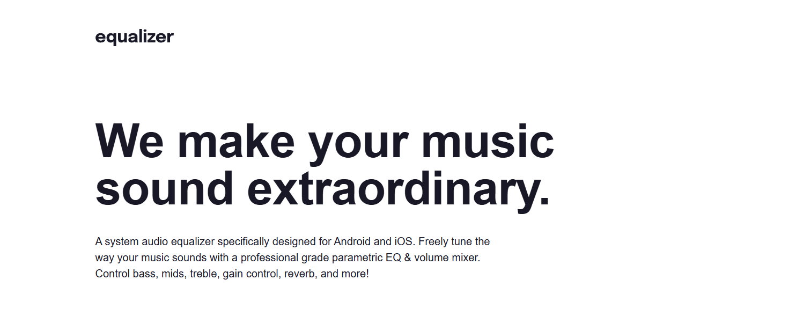
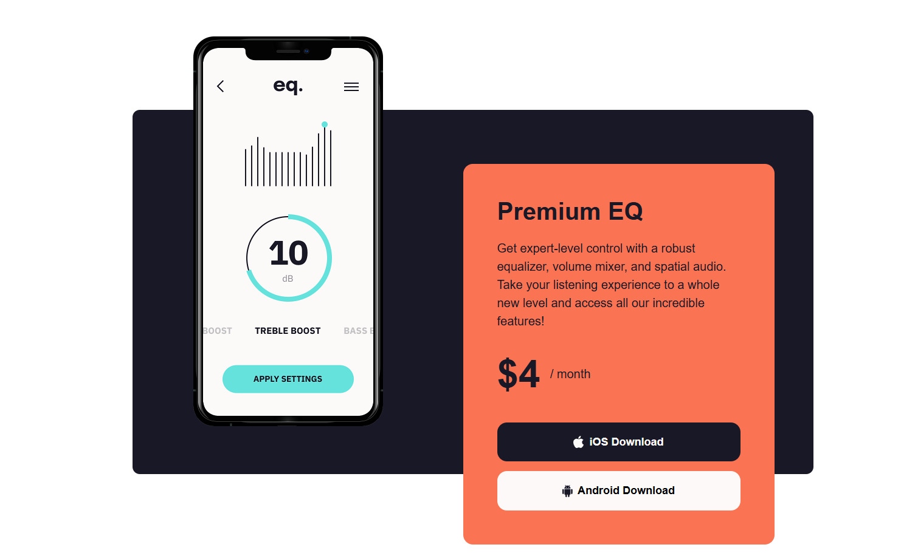

🎧 Equalizer Landing Page

A responsive Equalizer Landing Page built as part of a Frontend Mentor challenge.
The project focuses on creating a visually rich UI with overlapping elements, pricing section, and responsive layout.

🚀 Features

- Modern landing page layout
- Overlapping images and layered design
- Pricing section with subscription plan
- Download buttons (iOS & Android)
- Responsive layout (mobile → desktop)
- Clean modern UI with bold visuals

| Technology             | Purpose            |
| ---------------------- | ------------------ |
| **HTML5**              | Semantic structure |
| **CSS3**               | Styling and layout |
| **Flexbox / CSS Grid** | Layout alignment   |
| **GitHub Pages**       | Deployment         |

📸 Sections

Hero Section

Services Section

Footer Section

